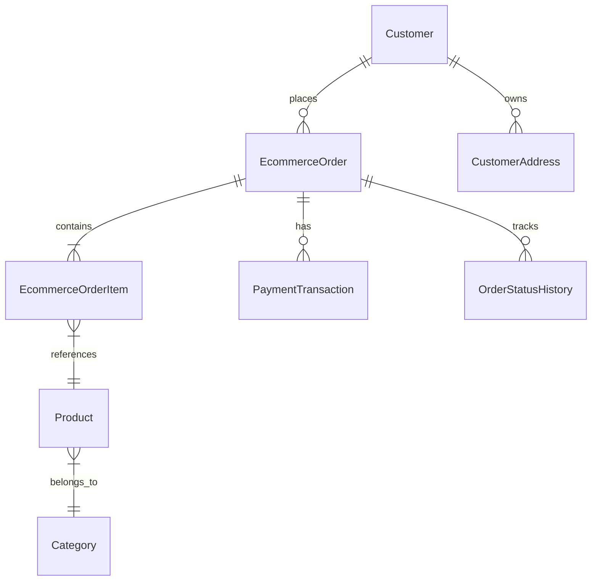

# ZamZam China-to-BD E-Commerce Master Plan

> **Status:** Draft  
> **Last Updated:** 2026-06-12  
> **Audience:** Product owner, development team, and business stakeholders

---

## Introduction

This document defines the e-commerce roadmap for ZamZam ERP. The goal is to extend the current ERP into a China-to-Bangladesh wholesale and retail ordering platform where customers can browse products, place orders, track delivery, and view clear landed cost estimates.

The e-commerce system should reuse the existing ERP modules wherever possible, especially inventory, customers, sales, purchases, accounts, reports, and audit logs. This plan is intended to guide implementation decisions, development phases, and future stakeholder discussions.

---

## 1. Project Vision and Scope

### 1.1 Vision Statement

ZamZam will become a China-to-Bangladesh wholesale and e-commerce platform where customers can order both in-stock and non-stock products. Customers should be able to:

- Browse available products with real-time stock information.
- Submit wholesale purchase orders.
- Order imported products from China at imported pricing.
- Compare shipping options by air or sea.
- See shipping cost, tax, customs duty, and other cost breakdowns before placing an order.
- Track order status from placement to delivery.

### 1.2 Business Model

- Serve both wholesale and retail customers in Bangladesh.
- Target local resellers, shop owners, online sellers, and direct buyers.
- Generate revenue through product margin, shipping charges, service fees, and optional import handling fees.
- Differentiate from competitors with transparent China import pricing, real-time shipping cost calculation, and clear customs/tax breakdowns.

### 1.3 Scope

The first version should focus on a stable customer-facing storefront, product catalog, cart, checkout, customer account, order tracking, and admin order management. Advanced features such as multi-vendor marketplace, affiliate system, AI recommendations, and live map tracking can come later.

---

## 2. Leveraging Existing ERP Modules

### 2.1 Inventory to Product Catalog

- Categories become e-commerce navigation and product filters.
- Products provide name, description, images, SKU, price, stock, VAT, and status.
- Product status controls storefront visibility, such as available, hidden, coming soon, or discontinued.
- Stock movements provide real-time stock availability.

### 2.2 Purchasing to Supply Chain

- Suppliers, purchases, and China-to-BD costing should feed landed cost calculations.
- When a purchase is received, stock should update automatically.
- Supplier purchase history can help estimate future import cost.

### 2.3 Sales Orders to Order Management

- Decide whether to reuse the existing sales order model or create separate e-commerce order tables.
- E-commerce orders should eventually connect to sales, payments, accounts, invoices, and audit logs.

### 2.4 Customers to E-Commerce Accounts

- Existing customers can be reused as e-commerce customers.
- Customer login should support phone or email.
- Customer profile should store shipping addresses, order history, and payment history.

### 2.5 Accounts and Payments

- Track payment status, due amount, refunds, COD collection, and gateway transactions.
- Keep customer balance and supplier balance aligned with the ERP accounts module.

### 2.6 Reports and Audit

- Sales reports, purchase reports, customer reports, stock reports, and audit logs should include e-commerce activity.
- Important actions such as order status changes, payment verification, refund approval, and stock adjustments must be auditable.

---

## 3. E-Commerce Feature Specification

### 3.1 Public Frontend

- [ ] Homepage or landing page
- [ ] Product catalog with category filters, search, sorting, and pagination
- [ ] Product detail page with images, description, price, stock, VAT, and cost breakdown
- [ ] Shopping cart
- [ ] Checkout flow
- [ ] Customer registration and login
- [ ] Customer account dashboard
- [ ] Order history
- [ ] Order tracking by order number
- [ ] Product reviews and ratings
- [ ] Wishlist
- [ ] Coupon or discount code support
- [ ] Shipping options such as standard, express, Dhaka, and outside Dhaka
- [ ] Payment gateway integration for bKash, Nagad, card, and COD
- [ ] Order email or SMS notifications
- [ ] Product comparison
- [ ] SEO-friendly URLs and meta tags
- [ ] Mobile-responsive design
- [ ] Chat, help, or support bot
- [ ] Back-in-stock notification
- [ ] Product variants such as size, color, and live stock
- [ ] Multiple product images with zoom

### 3.2 Admin Panel

- [ ] E-commerce dashboard with orders, revenue, pending payments, and low stock
- [ ] Order management for new, processing, shipped, delivered, cancelled, returned, and refunded orders
- [ ] Product featuring for homepage and campaign sections
- [ ] Banner and slider management
- [ ] Promotion, discount, and coupon management
- [ ] Shipping rate management
- [ ] Payment verification
- [ ] Invoice generation
- [ ] Notification management
- [ ] Order automation rules
- [ ] Activity log for orders, stock, payments, and refunds
- [ ] Automatic invoice generation after order completion
- [ ] Automatic stock deduction when order status reaches the configured stage
- [ ] Return and refund management

### 3.3 Localization and Bangladesh-Specific Features

- [ ] English-first admin and documentation
- [ ] Optional Bangla and English customer-facing UI
- [ ] BDT currency formatting
- [ ] Bangladesh address format with division, district, upazila, and area
- [ ] Area-based shipping rates
- [ ] Cash on delivery
- [ ] Delivery time slot selection
- [ ] Return and refund policy workflow
- [ ] Customer support ticket system
- [ ] Order invoice PDF download
- [ ] Warehouse or stock location management
- [ ] Delivery rider assignment
- [ ] Real-time order tracking map
- [ ] Advanced reports and analytics
- [ ] Multi-vendor marketplace
- [ ] Affiliate system
- [ ] Subscription box model
- [ ] AI product recommendations
- [ ] Live order updates with WebSocket

---

## 4. Technical Architecture

### 4.1 Frontend Stack Options

| Option | Benefits | Tradeoffs |
|---|---|---|
| Laravel Blade + Livewire | Fits the current Laravel stack, simpler deployment, fast to build | Less SPA-like experience |
| Inertia + Vue or React | Modern SPA feel with Laravel backend | Adds a new frontend layer |
| Standalone SPA with Next.js or Nuxt | Full separation and strong frontend flexibility | Requires separate deployment and API discipline |

**Recommended starting point:** Laravel Blade or Livewire, unless a fully separate public storefront is required. This keeps deployment simple and allows the ERP and storefront to share models and business logic.

### 4.2 Backend and API

- Use the existing Laravel application as the primary backend.
- Add REST API endpoints only where needed for frontend interactivity, mobile app support, or future integrations.
- Keep business logic in services instead of controllers or UI resources.
- Use policies, permissions, validation, and audit logs consistently.

### 4.3 Database Design

Possible new tables:

- `ecommerce_orders`
- `ecommerce_order_items`
- `ecommerce_carts`
- `ecommerce_cart_items`
- `customer_addresses`
- `product_images`
- `product_variants`
- `coupons`
- `coupon_redemptions`
- `shipping_methods`
- `shipping_rates`
- `payment_transactions`
- `order_status_histories`
- `returns`
- `refunds`

### 4.4 Entity Relationship Draft



---

## 5. API Design

### 5.1 Public API Endpoints

```text
GET    /api/v1/products              Product list with filters, search, and pagination
GET    /api/v1/products/{slug}       Product details
GET    /api/v1/categories            Category tree
GET    /api/v1/cart                  Current cart
POST   /api/v1/cart/add              Add item to cart
PUT    /api/v1/cart/update/{id}      Update cart item
DELETE /api/v1/cart/remove/{id}      Remove cart item
POST   /api/v1/orders                Place order
GET    /api/v1/orders/{id}           Order details
GET    /api/v1/customer/orders       Customer order list
```

### 5.2 Authentication

- Use Laravel Sanctum for token-based API authentication if a mobile app or separate SPA is planned.
- Use Laravel session authentication or Fortify if the storefront is Blade or Livewire based.
- Customer auth should support email or phone-based login.

### 5.3 Response Format

```json
{
    "success": true,
    "data": {},
    "message": "...",
    "meta": {
        "current_page": 1,
        "last_page": 10,
        "total": 100
    }
}
```

---

## 6. UI and UX Guidelines

### 6.1 Design Principles

- Mobile-first and responsive.
- Fast loading with a Lighthouse score target of 90 or higher.
- Clear product-first design.
- Simple browsing, cart, and checkout flow.
- Trust-building details such as stock status, delivery estimate, cost breakdown, and order tracking.
- Avoid cluttered layouts and unnecessary visual effects.

### 6.2 Required Pages

| Page | Required Content |
|---|---|
| Homepage | Banner, featured products, categories, search, and campaign sections |
| Category Page | Filter sidebar, product grid, sorting, pagination |
| Product Page | Image gallery, price, stock, variants, description, reviews, buy now |
| Cart | Product list, quantity controls, totals, coupon, checkout button |
| Checkout | Address form, shipping option, payment method, order summary |
| Order Tracking | Order history, current status, delivery progress |
| Login/Register | Phone or email registration and login |
| Customer Dashboard | Profile, addresses, orders, invoices, returns |

### 6.3 Component Library Options

| Option | Best Use |
|---|---|
| Blade Components | Laravel Blade or Livewire storefront |
| Tailwind CSS + Headless UI | Stack-independent custom UI |
| shadcn/ui | React-based storefront |
| PrimeVue | Vue-based storefront |

---

## 7. Payment and Shipping Integrations

### 7.1 Payment Gateways

| Gateway | Status |
|---|---|
| bKash Merchant API | Planned |
| Nagad Merchant API | Planned |
| SSL Commerz | Planned |
| Cash on Delivery | Planned |
| Manual Bank Transfer | Planned |

### 7.2 Shipping

| Method | Status |
|---|---|
| Standard delivery inside Dhaka | Planned |
| Standard delivery outside Dhaka | Planned |
| Express delivery | Planned |
| Courier API integration with Pathao, Steadfast, or RedX | Future |
| Air shipping from China | Planned |
| Sea shipping from China | Planned |

### 7.3 China-to-BD Cost Calculation

The product order page should show a clear cost breakdown when the product is imported from China:

- Product base price
- China local cost if applicable
- International shipping method: air or sea
- International shipping estimate
- Customs duty
- Tax or VAT
- Service fee
- Local delivery charge
- Final estimated landed cost

---

## 8. SEO and Performance

- [ ] SEO-friendly slug-based URLs
- [ ] Meta title, description, and Open Graph tags
- [ ] Product image optimization with WebP and lazy loading
- [ ] Auto-generated XML sitemap
- [ ] Structured data with JSON-LD for products
- [ ] Google Analytics or similar analytics
- [ ] Facebook Pixel or Meta conversion tracking
- [ ] Laravel cache strategy
- [ ] Redis cache where useful
- [ ] CDN for public assets
- [ ] Image CDN such as Cloudinary, Bunny, or similar
- [ ] Asset fingerprinting and versioning
- [ ] Database indexes for high-traffic product and order queries

---

## 9. Security

- [ ] Enforce HTTPS
- [ ] Use Laravel CSRF, validation, escaping, and query protection
- [ ] Rate limit public API endpoints
- [ ] Validate all customer input
- [ ] Restrict file uploads by type, size, and storage path
- [ ] Avoid storing card data directly
- [ ] Follow payment gateway security requirements
- [ ] Encrypt sensitive customer data where appropriate
- [ ] Reuse the existing audit log system
- [ ] Require permissions for admin e-commerce actions
- [ ] Log payment verification, refunds, and order status changes

---

## 10. Phase Roadmap

### Phase 10: E-Commerce Foundation

**Goal:** Launch the public storefront structure, product catalog, core API, and basic SEO foundation.

- [ ] Finalize frontend stack decision
- [ ] Add public route structure
- [ ] Build product catalog pages
- [ ] Build category pages
- [ ] Add search and filters
- [ ] Build product detail page
- [ ] Add product and category API endpoints
- [ ] Add basic localization structure
- [ ] Add SEO basics

**Done Criteria:** Customers can browse products, search, filter, view product details, and use the site comfortably on mobile.

### Phase 11: Cart, Checkout, and Orders

- [ ] Shopping cart for guest and logged-in customers
- [ ] Checkout flow
- [ ] Order placement
- [ ] Customer account registration and login
- [ ] Customer order tracking
- [ ] Email or SMS notifications
- [ ] Payment gateway integration
- [ ] Cash on delivery

**Done Criteria:** Customers can place orders and track them from their account or by order number.

### Phase 12: Admin E-Commerce Control

- [ ] E-commerce dashboard
- [ ] Order management dashboard
- [ ] Order status flow: pending, processing, shipped, delivered, cancelled, returned, refunded
- [ ] Banner management
- [ ] Discount and coupon management
- [ ] Shipping management
- [ ] Payment verification
- [ ] PDF invoices
- [ ] Admin audit trail

**Done Criteria:** Admin users can manage the full order lifecycle from the ERP panel.

### Phase 13: Advanced Features

- [ ] Product reviews and ratings
- [ ] Wishlist
- [ ] Related products
- [ ] Promotional campaigns
- [ ] Abandoned cart recovery
- [ ] Analytics integration
- [ ] Support ticket system
- [ ] Return and refund workflow

**Done Criteria:** The storefront supports stronger customer engagement, support, and marketing workflows.

### Phase 14: Scale and Optimization

- [ ] CDN integration
- [ ] Redis optimization
- [ ] Database index optimization
- [ ] Image CDN and resize pipeline
- [ ] Load testing
- [ ] Monitoring setup
- [ ] Queue-based notifications
- [ ] Background job monitoring

**Done Criteria:** The e-commerce system can support production traffic with stable performance and monitoring.

---

## 11. Development Rules

Every e-commerce feature should follow the same implementation discipline used in the ERP:

1. Migration
2. Model
3. Relationships
4. Admin resource or controller
5. Form schema
6. Table columns and filters
7. Infolist or detail view
8. Business logic or service class
9. Report or export updates if relevant
10. Permission and audit checks if relevant
11. Automated tests
12. Manual verification
13. Update project documentation
14. Update `ECOMMERCE_PLAN.md` when the roadmap changes

---

## 12. Deployment

Follow the existing production operations process. Additional e-commerce deployment requirements:

- [ ] E-commerce-specific environment variables
- [ ] Payment gateway credentials
- [ ] Courier API credentials
- [ ] SMTP or mail service configuration
- [ ] SMS gateway configuration if used
- [ ] SSL certificate
- [ ] Domain and DNS setup
- [ ] Queue worker configuration
- [ ] Scheduler configuration
- [ ] Backup plan for orders, payments, and customer data

---

## 13. Creative Notes

Use this section to collect ideas before they become formal requirements.

### 13.1 Brainstorm

- Create product pages that explain landed cost clearly.
- Add customer trust signals such as delivery estimate, warranty note, and verified supplier note.
- Highlight China direct import pricing as a key business advantage.

### 13.2 Competitor References

| Site | Strengths | Weaknesses |
|---|---|---|
| TBD | TBD | TBD |

### 13.3 Design Inspiration

- Product-first layouts with strong search and category discovery.
- Fast mobile checkout.
- Clear order tracking and delivery expectation UI.

### 13.4 Open Questions

- [ ] Should the storefront be Blade/Livewire or a separate SPA?
- [ ] Should e-commerce orders reuse the sales order model or use separate tables?
- [ ] Should customer login use phone, email, or both?
- [ ] Which payment gateway should be implemented first?
- [ ] Which courier provider should be integrated first?
- [ ] How should China import shipping rates be maintained?
- [ ] Should non-stock China products require admin approval before order confirmation?

---

## 14. Meeting Notes and Decision Log

| Date | Topic | Decision | Participants |
|---|---|---|---|
| YYYY-MM-DD | TBD | TBD | TBD |

---

## Next Step

Choose the section that should be implemented first, then expand it into detailed tasks, database changes, UI screens, API routes, and tests.
